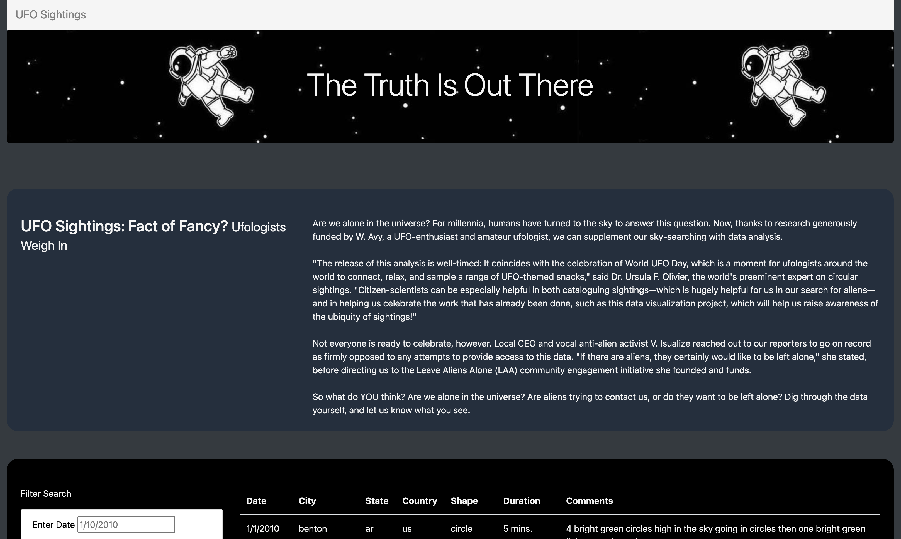
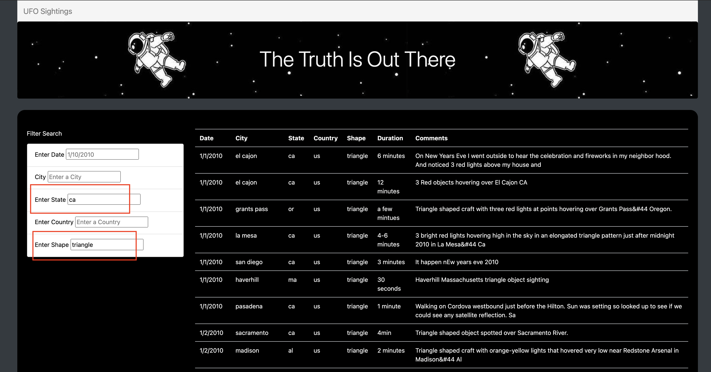

# Project Overview - UFOs

This project uses the library D3 in order to provide filters of UFO sightings dataset. It allows users to filter by city, state, country, and shape on a specific table.

Live Demo (GitHub.io): https://poboisvert.github.io/UFOs/

## Resources

- Dataset (static/js): data.js
- Software: HTML, CSS, JavaScript (ES6 babel), D3.js.

## Navigation

The website present a small space picture and a quick summary on why some enjoy reading on UFO. To reset a filter, the user needs to empty the selected field a click outsie the input.

### Searching

At the botton of the website, we can find a table that include in the header a Date, City, State, Country, Shape, Duration and finally Comments section.

## Summary

### Drawback

This interface provide a single analysis with a case by case display. It may not use easier or fast to analyze the trend on this dataset with the actual interface.

### Suggestion

- 1: Add a stastical box over the table to get a first impression.
- 2: some keywords in the comments section may give the another insights that could not have been records by the data.
